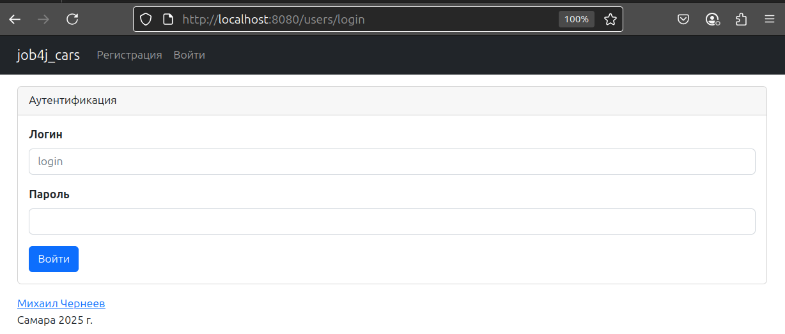
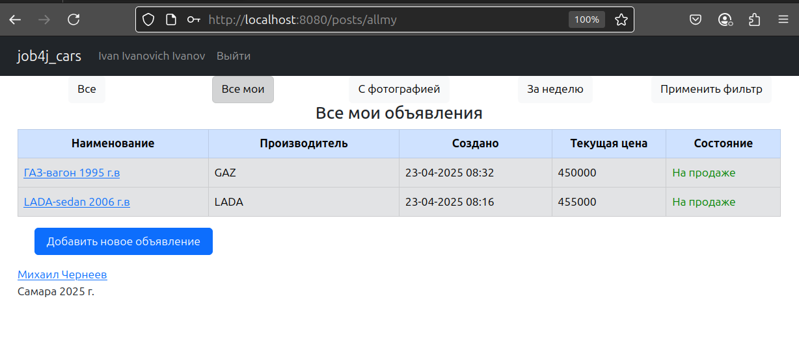
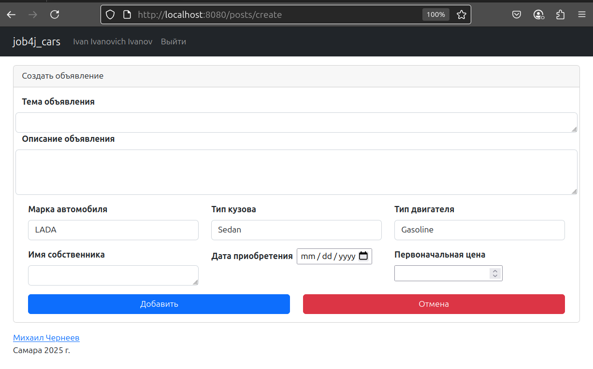
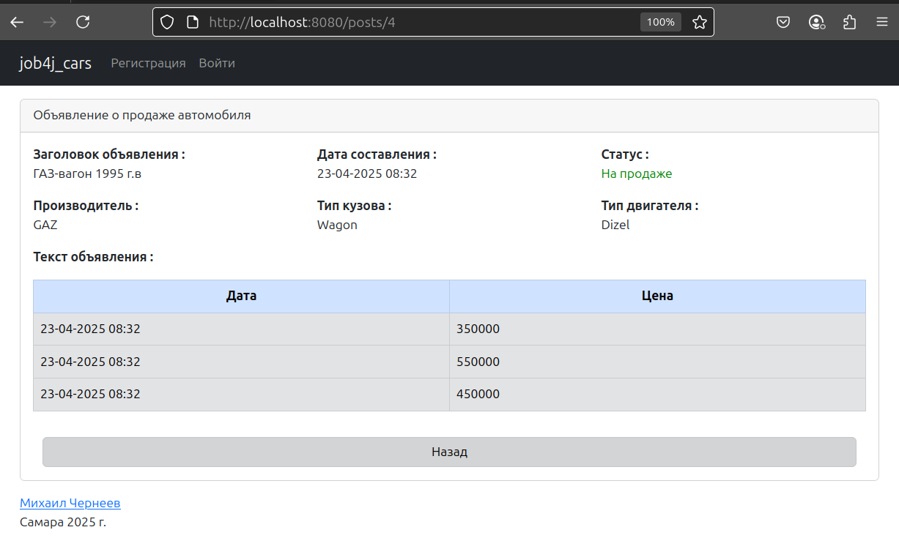
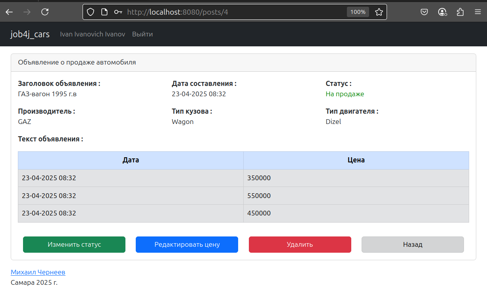
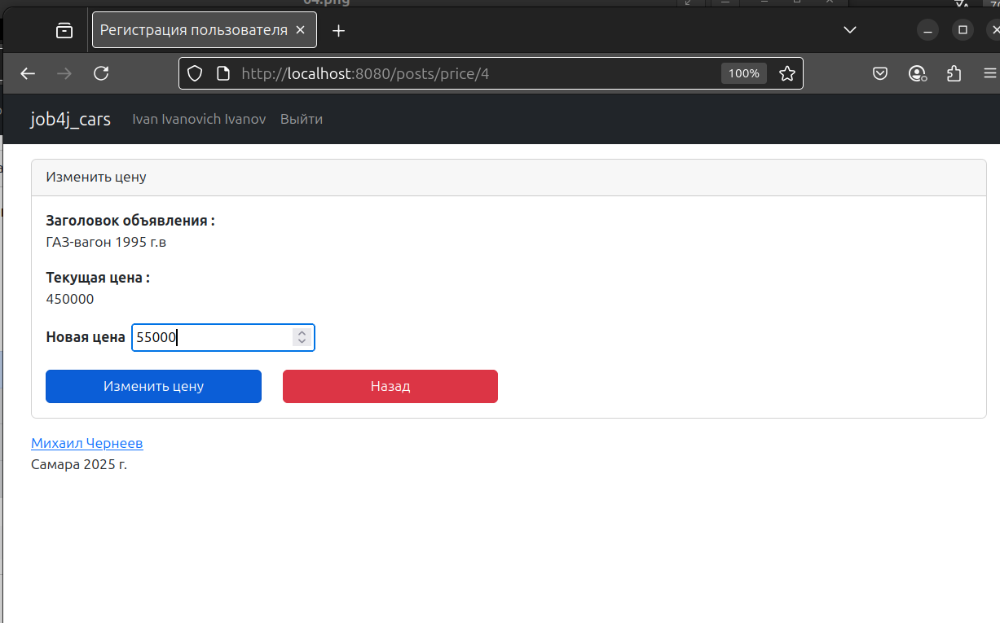
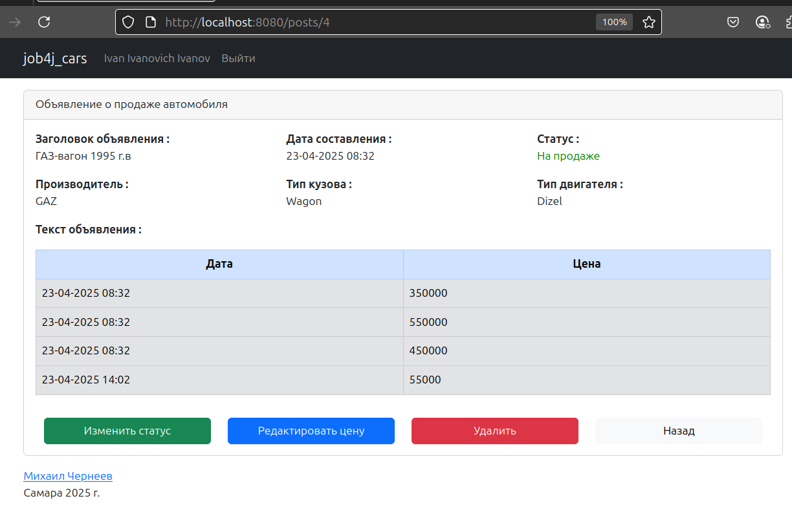

## Проект "Веб-Сервис АвтоМаг".

### Описание задачи:
Цель проекта - разработка веб-приложения для продажи машин.

Основной функционал включает:

1. Основная страница. таблица со всеми объявлениям машин на продажу.
2. На странице реализована кнопка. добавить новое объявление.
3. Реализован переход на страницу добавления.
4. Реализован выбор марки машин, тип кузова и двигателя.
5. Объявление имеет статус продано. или нет.
7. Реализовано существование пользователей в приложении. только тот пользователь, который подал объявление, может вносить изменения.

### Используемые технологии:
+ Java 17
+ Thymeleaf
+ Spring Boot
+ Hibernate

### Окружение:
+ Java 17
+ Maven
+ PostgreSQL

### Запуск приложения

1. Создайте базу данных PostgreSQL
``` sql
CREATE USER cars WITH PASSWORD 'cars';
CREATE DATABASE cars
GRANT ALL PRIVILEGES ON DATABASE cars to cars;
```

2. Клонируйте репозиторий
``` bash
cd job4j_cars
git clone https://github.com/MikhailChrn/job4j_cars
```

3. Соберите проект с помощью Maven:
``` bash
mvn clean install 
```

4. Запустите приложение:
``` bash
mvn spring-boot:run
```
5. После запуска:
Проект доступен по адресу: [http://localhost:8080](http://localhost:8080)

### Взаимодействие с приложением

1. Вход



2. Главная



3. Добавить новое объявление



4. Просмотр существующего объявления



5. Просмотр существующего объявления 



6. Изменение цены объявления





### Контакты

mikhail.cherneyev@yandex.ru
